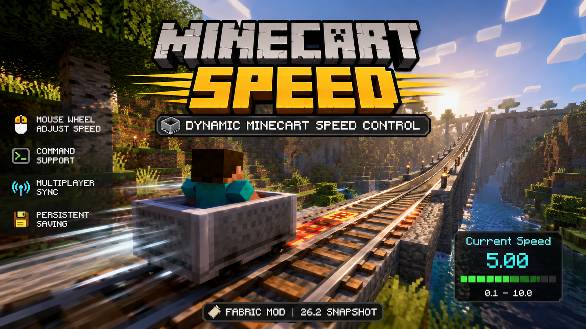

# 🚄 MinecartSpeed

<p align="center">
  
</p>

<p align="center">
  A modern <b>Fabric</b> mod that allows players to dynamically adjust minecart speed using the mouse wheel or commands.
</p>

<p align="center">
  <a href="./LICENSE">
    
  </a>
  <a href="https://minecraft.net">
    
  </a>
  <a href="https://fabricmc.net">
    
  </a>
  <a href="https://adoptium.net">
    
  </a>
</p>


<p align="center">
  <a href="README_zh.md">简体中文</a> | English
</p>

---

## ✨ Features

- 🖱️ **Mouse Wheel Adjustment**  
  Scroll the mouse wheel while riding a minecart to dynamically change its maximum speed.

- ⌨️ **Command Support**  
  Use `/minecartspeed` commands for precise speed control.

- 💾 **Persistent Storage**  
  Minecart speed settings are saved with the world and persist after restarting the game.

- 🌐 **Client-Server Synchronization**  
  Mouse wheel actions are synchronized to the server using Fabric networking.

- 🎯 **Customizable Speed Range**  
  Adjustable from `0.1` to `10.0` (default: `0.4`).

---

## 📋 Commands

| Command | Description |
|---|---|
| `/minecartspeed get` | Get the max speed of your current minecart |
| `/minecartspeed get <player>` | Get another player's minecart speed |
| `/minecartspeed set <speed>` | Set your minecart speed |
| `/minecartspeed set <speed> <player>` | Set another player's minecart speed |
| `/minecartspeed add <value>` | Increase or decrease speed |
| `/minecartspeed add <value> <player>` | Modify another player's minecart speed |

> 💡 Speed values are automatically clamped between `0.1` and `10.0`.

---

## 🎮 Usage

1. Ride any minecart
2. Scroll **up** to increase speed
3. Scroll **down** to decrease speed
4. Current speed is displayed in real time on screen

### Example Commands

```mcfunction
# Get current speed
/minecartspeed get

# Set speed to 2.5
/minecartspeed set 2.5

# Increase speed by 0.5
/minecartspeed add 0.5
```

---

## 📦 Installation

| Dependency | Requirement |
|---|---|
| Minecraft | `26.2-snapshot-8` *(Other supported versions may be available in Releases)* |
| Fabric Loader | `>= 0.19.2` |
| Fabric API | Latest |
| Java | `>= 25` |

### Steps

1. Install [Fabric Loader](https://fabricmc.net/use/)
2. Download [Fabric API](https://modrinth.com/mod/fabric-api)
3. Place both the mod `.jar` file and Fabric API into your `.minecraft/mods/` folder
4. Launch Minecraft 🚀

---

## ⚠ Snapshot Compatibility

This mod is currently developed for Minecraft snapshots.  
APIs and internal Minecraft code may change frequently between versions.

---

## 🏗️ Building

```bash
./gradlew build
```

Build artifacts will be generated in:

```text
build/libs/
```

---

## 🌐 Installation Requirements

| Environment | Required |
|---|---|
| Client | ✅ Required |
| Server | ✅ Recommended |

> Full functionality requires both the client and server to have the mod installed.  
> If installed only on the server, command features will still work, but mouse wheel speed control and HUD display will be unavailable.

---

## 🗺 Roadmap

- [x] Dynamic minecart speed control
- [x] Mouse wheel adjustment
- [x] Command support
- [x] Persistent storage
- [ ] Config GUI
- [ ] Per-world configuration
- [ ] Dedicated server config sync
- [ ] NeoForge or others support

---

## 👥 Authors

- **ukhankhulun**
- **hongshaoluobotou**

---

## 📄 License

This project is licensed under the [CC0-1.0](LICENSE) license.  
Feel free to use, modify, and distribute it freely.

---

## 🔗 Links

- GitHub Repository  
  https://github.com/ukhankhulun/minecartspeed

- Fabric Documentation  
  https://docs.fabricmc.net

- Modrinth  
  https://modrinth.com/mod/minecartspeed-mod

---